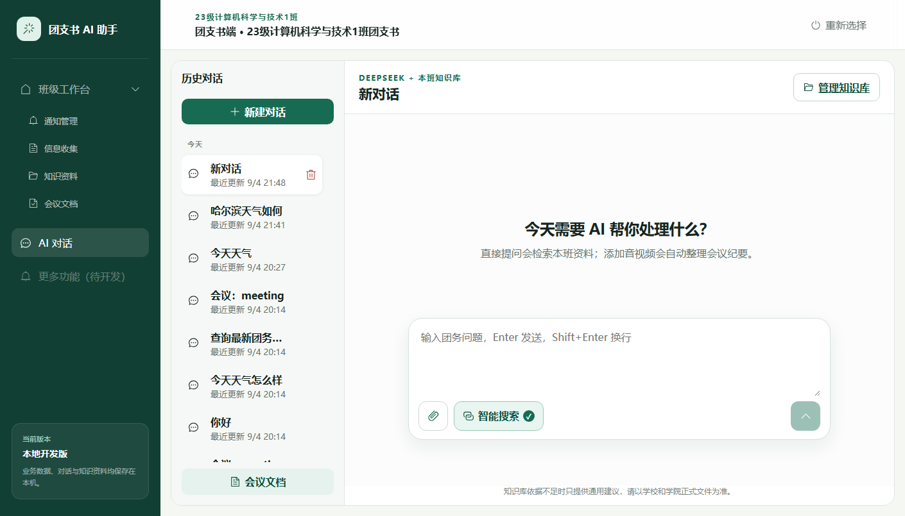
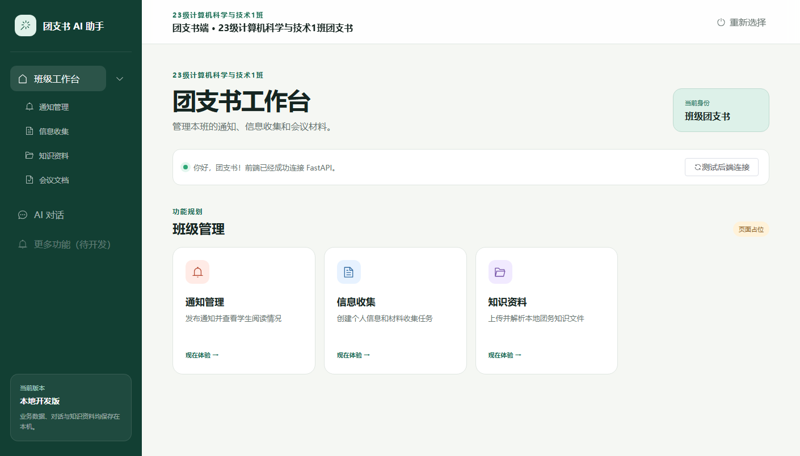
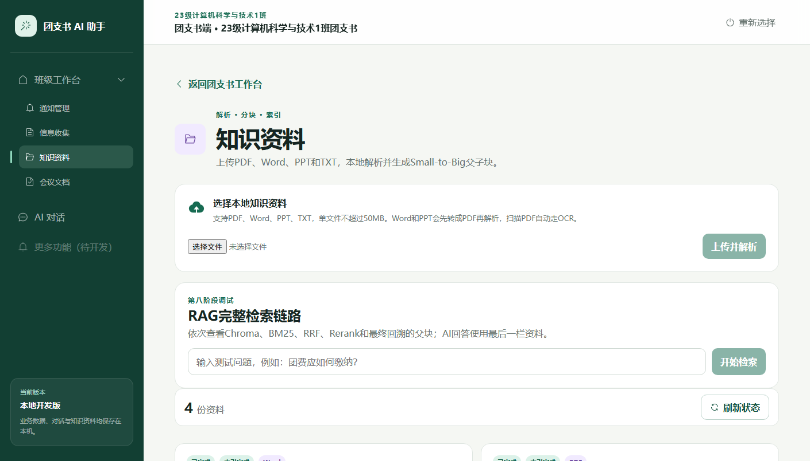
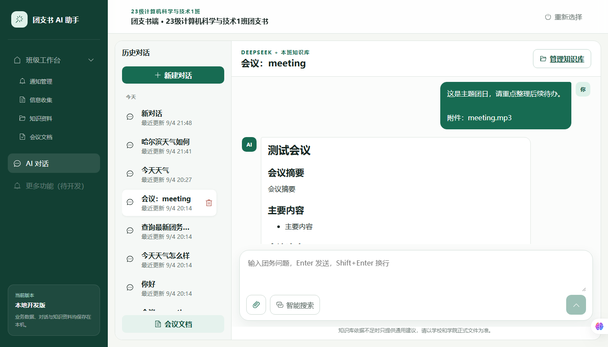
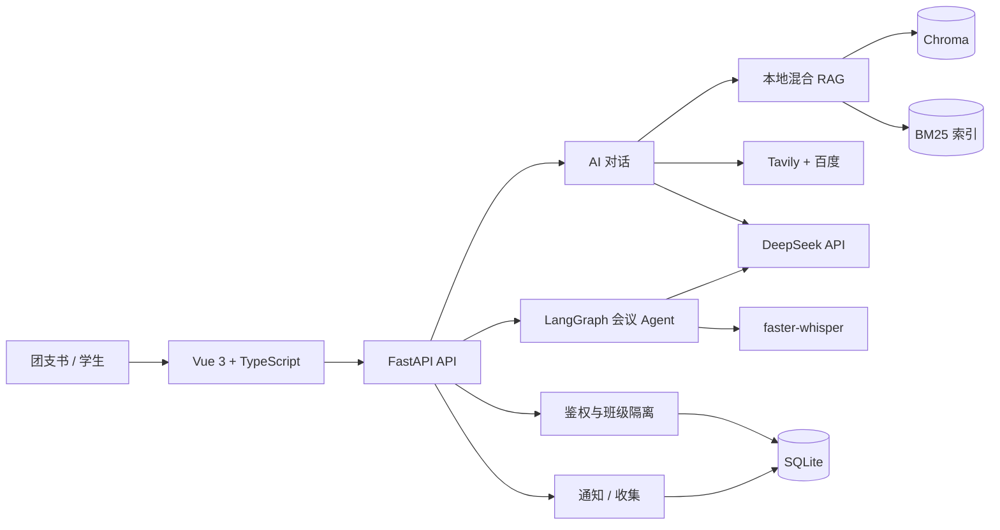
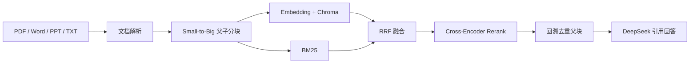
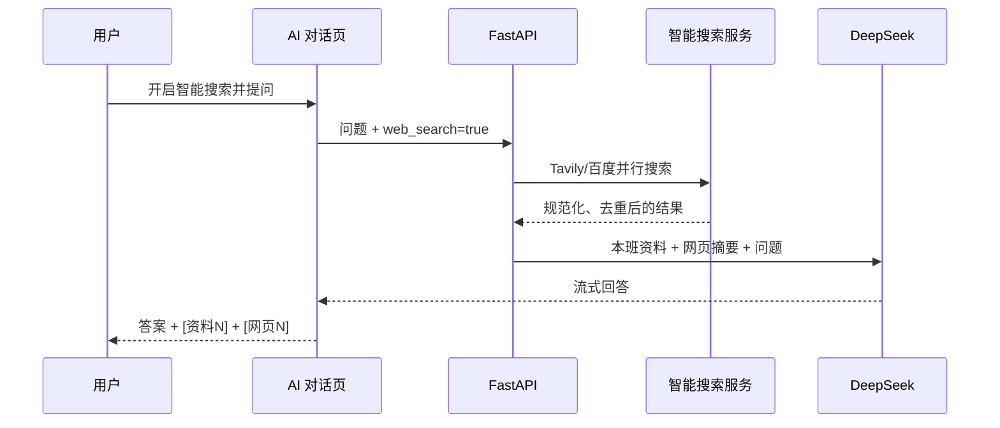
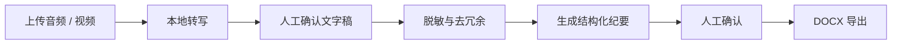

<div align="center">

# 团支书 AI 助手

**面向高校班级团务的本地 AI 协作平台**

通知管理 · 信息收集 · 本班知识库 · 智能搜索 · 会议 Agent


</div>



## 项目简介

团支书 AI 助手是一套运行在本地 Windows 电脑上的班级团务平台。团支书可以管理通知、信息收集、会议纪要和班级知识资料；学生可以查看本班通知、提交信息，并通过统一 AI 对话查询团务知识。

账号、附件、知识原文、向量索引和会议转写保存在本机；只有生成最终回答时会调用 DeepSeek API。

## 目录导航

| 目录 | 用途 | 详细说明 |
| --- | --- | --- |
| `backend` | FastAPI 接口、RAG、Agent、LLM、智能搜索和本地数据服务 | [后端目录说明](backend/README.md) |
| `frontend` | Vue 3 页面、组件、路由、状态管理和 API 封装 | [前端目录说明](frontend/README.md) |
| `docs` | 产品方案、技术设计、功能规格和 README 截图 | [文档目录说明](docs/README.md) |

## 核心功能

| 能力 | 说明 |
| --- | --- |
| AI 问答 | ChatGPT 式对话页、历史会话、多轮上下文、SSE 流式输出和 Markdown 渲染 |
| 本班知识库 | 支持 PDF、Word、PPT 和 TXT，只使用当前班级已启用资料 |
| 混合 RAG | Small-to-Big 分块、Chroma 向量检索、BM25、RRF 融合和 Cross-Encoder 重排 |
| 智能搜索 | 按需并行调用 Tavily 和百度，合并去重后由 DeepSeek 总结并展示来源 |
| 会议 Agent | 音视频转写、人工确认、脱敏、LangGraph 编排、纪要生成和 Word 导出 |
| 通知管理 | 创建、发布、撤回、附件下载与学生已读统计 |
| 信息收集 | 自定义字段、附件提交、退回重交和 CSV 导出 |
| 班级隔离 | 本地 JWT 鉴权，团支书与学生按班级隔离数据 |

## 界面预览

| 班级工作台 | AI 智能搜索 |
| --- | --- |
|  |  |
| 本班知识库 | 会议助手 |
|  |  |

## 系统架构



### RAG 检索链路



小块用于精确检索，最终交给大模型的是信息更完整的父块。低于相关性阈值的结果不会进入回答，也不会显示错误引用。

### 智能搜索链路



Tavily 未配置或单个搜索源失败时，系统会继续使用可用搜索源。外部网页内容会被当作不可信资料，其中的操作指令不会被执行。

### 会议 Agent 链路



## 技术栈

| 层级 | 技术 |
| --- | --- |
| 前端 | Vue 3、TypeScript、Vite、Element Plus、Pinia |
| API | FastAPI、Pydantic、SSE |
| 数据 | SQLite、SQLAlchemy、Chroma、BM25 |
| 大模型 | DeepSeek API |
| 检索 | `BAAI/bge-small-zh-v1.5`、`BAAI/bge-reranker-base`、RRF |
| Agent | LangGraph、SQLite Checkpointer |
| 音视频 | FFmpeg、faster-whisper |
| 文档 | PyMuPDF、Tesseract OCR、LibreOffice、python-docx |
| 外网搜索 | Tavily API、百度搜索 |

## 快速开始

### 环境要求

- Windows 10/11，Python 3.11/3.12，Node.js 20+
- 至少 8 GB 内存和 5 GB 可用磁盘，建议 16 GB 内存
- Word/PPT、扫描 PDF 和音视频功能需安装 LibreOffice、Tesseract OCR 和 FFmpeg

```powershell
winget install --id TheDocumentFoundation.LibreOffice --source winget
winget install --id UB-Mannheim.TesseractOCR --source winget
winget install --id Gyan.FFmpeg --source winget
```

### 1. 安装后端

```powershell
cd backend
py -m venv .venv
.\.venv\Scripts\python.exe -m pip install -r requirements.txt
Copy-Item .env.example .env
```

编辑 `backend/.env`，至少配置：

```dotenv
JWT_SECRET=换成仅自己知道的随机长文本
DEEPSEEK_API_KEY=你的_DeepSeek_API_Key
TAVILY_API_KEY=你的_Tavily_API_Key
```

Tavily Key 可以留空，此时智能搜索仅使用百度。真实密钥只能放在 `.env`。

### 2. 安装前端

```powershell
cd frontend
npm install
```

### 3. 启动项目

后端窗口：

```powershell
cd backend
.\.venv\Scripts\python.exe -m uvicorn app.main:app --reload
```

前端窗口：

```powershell
cd frontend
npm run dev
```

- 前端：<http://localhost:5173>
- API 文档：<http://127.0.0.1:8000/docs>
- 健康检查：<http://127.0.0.1:8000/api/health>

## 演示账号

| 班级 | 团支书账号 | 初始密码 | 学生邀请码 |
| --- | --- | --- | --- |
| 23 级计算机科学与技术 1 班 | `secretary1` | `123456` | `JSJ23-1` |
| 23 级软件工程 1 班 | `secretary2` | `123456` | `RJGC23-1` |
| 23 级数据科学与大数据技术 1 班 | `secretary3` | `123456` | `SJ23-1` |

团支书直接登录；学生在登录页使用邀请码注册。正式使用前请修改演示密码和 `JWT_SECRET`。

## 项目结构

```text
团支书助手/
├── backend/                       # FastAPI 后端
│   ├── app/
│   │   ├── main.py                # 应用入口与路由注册
│   │   ├── api/routers/            # HTTP 接口层
│   │   ├── core/                   # 配置、数据库、安全与文件
│   │   ├── models/                 # SQLAlchemy 实体
│   │   ├── llm/                    # DeepSeek 客户端与提示词
│   │   ├── rag/                    # 文档解析、分块、索引与检索
│   │   ├── agents/                 # LangGraph Agent 工作流
│   │   ├── search/                 # Tavily/百度搜索与结果融合
│   │   └── services/               # 音视频转写等服务
│   ├── evaluation/               # RAGAS 金标数据和评测脚本
│   ├── tests/                    # Pytest 自动化测试
│   ├── data/                     # 本地运行数据（Git 忽略）
│   └── requirements.txt          # 运行依赖
├── frontend/                      # Vue 3 前端
│   ├── src/api/                   # 后端 API 调用
│   ├── src/components/            # 通用布局与组件
│   ├── src/views/                 # 工作台、AI、知识库等页面
│   ├── src/router/                # 路由和角色守卫
│   ├── src/stores/                # Pinia 状态管理
│   └── src/styles/                # 全局样式
├── docs/assets/readme/             # README 真实界面截图
└── README.md
```

## 本地数据与备份

`backend/data/` 包含 SQLite 数据库、上传文件、Chroma/BM25 索引、本地模型、Agent 检查点、Word 纪要和 RAGAS 报告，已被 Git 忽略。备份或恢复时请先停止 FastAPI，然后整体复制或覆盖该目录。

## 测试与评估

```powershell
# 后端
cd backend
.\.venv\Scripts\python.exe -m pytest -q

# 前端
cd ..\frontend
npm run type-check
npm run build
```

RAGAS 评测需要额外安装 `requirements-eval.txt`，并在 `backend/evaluation/gold_dataset.json` 中填写真实金标：

```powershell
.\.venv\Scripts\python.exe -m evaluation.run_ragas --validate-only
.\.venv\Scripts\python.exe -m evaluation.run_ragas --class-id 1
```

## 安全与限制

- AI 内容仅作团务辅助，重要政策、截止日期和材料要求以正式文件为准。
- 智能搜索结果可能过时或错误，请通过来源链接人工核对。
- 本地模型首次使用时需要下载，CPU 首次加载会较慢。
- 当前不包含管理员端、云数据库、Docker 或多学校租户管理。

## 后续计划

- 使用真实团务资料完成 30 题 RAGAS 金标和首份评测报告。
- 增加 Windows 一键启动、备份和恢复工具。
- 继续改善检索可观测性与搜索来源质量。

## 贡献与许可

欢迎通过 Issue 或 Pull Request 提交问题、文档改进和功能建议。当前仓库尚未添加开源许可证；在许可证明确前，请不要默认项目可以被任意复制或商业使用。
